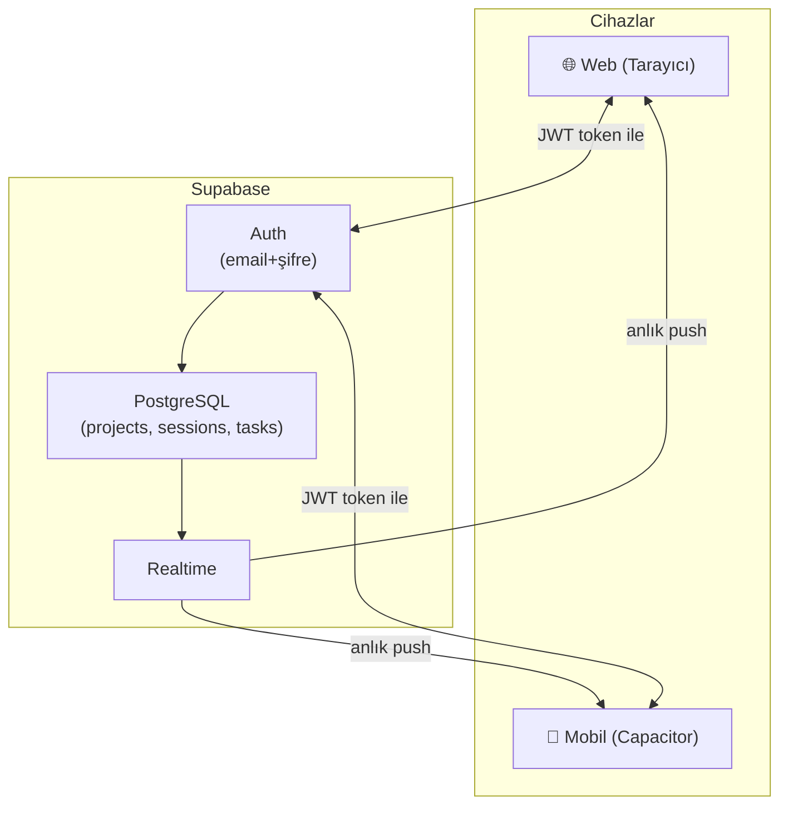

# Time Project: Web + Mobil (Capacitor) — Supabase + Tek Admin Auth

---

## Kararlaştırılan Mimari

| Alan | Seçim |
|---|---|
| **Web App** | Mevcut Vite + React |
| **Mobil App** | Capacitor (Android / iOS) |
| **Backend / DB** | Supabase (PostgreSQL + Realtime) |
| **Auth** | ✅ Tek admin kullanıcı (email + şifre, Supabase Auth) |
| **Offline** | ✅ Offline-first: önce localStorage, arka planda sync |
| **Kullanıcı tipi** | Tek kullanıcı, birden fazla cihaz |

---

## Admin Credentials

> [!IMPORTANT]
> **Email:** `admin@timeproject.app`  
> **Şifre:** `Terra#2026!Zaman`  
> Bu bilgileri güvende tutun. Supabase Dashboard → Authentication → Users'dan değiştirilebilir.

---

## Mimari Diyagramı



---

## Faz 1 — Supabase Kurulum + SQL Şema
**~30 dakika**

1. [supabase.com](https://supabase.com) → New Project (Region: Frankfurt)
2. Authentication → Users → "Invite user" → `admin@timeproject.app`
3. SQL Editor'de şema çalıştır:

```sql
CREATE TABLE projects (
  id UUID PRIMARY KEY DEFAULT gen_random_uuid(),
  user_id UUID REFERENCES auth.users(id) ON DELETE CASCADE NOT NULL,
  name TEXT NOT NULL,
  client_name TEXT,
  description TEXT,
  hourly_rate NUMERIC DEFAULT 0,
  currency TEXT DEFAULT '₺',
  type TEXT DEFAULT '',
  estimated_hours NUMERIC DEFAULT 0,
  status TEXT DEFAULT 'active',
  color TEXT DEFAULT '#4a7c59',
  created_at TIMESTAMPTZ DEFAULT now(),
  completed_at TIMESTAMPTZ,
  updated_at TIMESTAMPTZ DEFAULT now()
);

CREATE TABLE sessions (
  id UUID PRIMARY KEY DEFAULT gen_random_uuid(),
  user_id UUID REFERENCES auth.users(id) ON DELETE CASCADE NOT NULL,
  project_id UUID REFERENCES projects(id) ON DELETE CASCADE NOT NULL,
  start_time TIMESTAMPTZ NOT NULL,
  end_time TIMESTAMPTZ,
  description TEXT,
  duration BIGINT DEFAULT 0,
  updated_at TIMESTAMPTZ DEFAULT now()
);

CREATE TABLE tasks (
  id UUID PRIMARY KEY DEFAULT gen_random_uuid(),
  user_id UUID REFERENCES auth.users(id) ON DELETE CASCADE NOT NULL,
  project_id UUID REFERENCES projects(id) ON DELETE CASCADE NOT NULL,
  title TEXT NOT NULL,
  is_completed BOOLEAN DEFAULT false,
  created_at TIMESTAMPTZ DEFAULT now(),
  updated_at TIMESTAMPTZ DEFAULT now()
);

CREATE TABLE user_settings (
  user_id UUID PRIMARY KEY REFERENCES auth.users(id) ON DELETE CASCADE,
  user_name TEXT DEFAULT 'Kullanıcı',
  default_hourly_rate NUMERIC DEFAULT 0,
  currency TEXT DEFAULT '₺',
  updated_at TIMESTAMPTZ DEFAULT now()
);

-- updated_at trigger
CREATE OR REPLACE FUNCTION update_updated_at()
RETURNS TRIGGER AS $$
BEGIN NEW.updated_at = now(); RETURN NEW; END;
$$ LANGUAGE plpgsql;

CREATE TRIGGER trg_projects BEFORE UPDATE ON projects FOR EACH ROW EXECUTE FUNCTION update_updated_at();
CREATE TRIGGER trg_sessions BEFORE UPDATE ON sessions FOR EACH ROW EXECUTE FUNCTION update_updated_at();
CREATE TRIGGER trg_tasks BEFORE UPDATE ON tasks FOR EACH ROW EXECUTE FUNCTION update_updated_at();

-- Row Level Security — sadece kendi verilerine erişim
ALTER TABLE projects ENABLE ROW LEVEL SECURITY;
ALTER TABLE sessions ENABLE ROW LEVEL SECURITY;
ALTER TABLE tasks ENABLE ROW LEVEL SECURITY;
ALTER TABLE user_settings ENABLE ROW LEVEL SECURITY;

CREATE POLICY "own data" ON projects FOR ALL USING (auth.uid() = user_id);
CREATE POLICY "own data" ON sessions FOR ALL USING (auth.uid() = user_id);
CREATE POLICY "own data" ON tasks FOR ALL USING (auth.uid() = user_id);
CREATE POLICY "own data" ON user_settings FOR ALL USING (auth.uid() = user_id);
```

4. `.env` dosyasına ekle:
```
VITE_SUPABASE_URL=https://xxxxx.supabase.co
VITE_SUPABASE_ANON_KEY=eyJxxxx...
```

---

## Faz 2 — Data Layer (lib + services)
**~45 dakika**

### [NEW] `src/lib/supabase.js`
Supabase client singleton.

### [NEW] `src/services/api.js`
`projectsApi`, `sessionsApi`, `tasksApi`, `settingsApi` — her biri `select/insert/update/delete` metodlarına sahip.

### [NEW] `src/services/offlineQueue.js`
- Her yazma işlemini `localStorage`'daki kuyruğa ekle
- `navigator.onLine` ile network durumu izle
- Online olunca kuyruğu Supabase'e flush et
- `updated_at` ile last-write-wins çakışma çözümü

---

## Faz 3 — Auth + AppContext Güncelleme
**~45 dakika**

### [NEW] `src/context/AuthContext.jsx`
```
- currentUser, isLoading, isAuthenticated
- signIn(email, password) → supabase.auth.signInWithPassword()
- signOut()
- onAuthStateChange listener
```

### [NEW] `src/pages/LoginPage.jsx`
Mevcut design system ile uyumlu login formu. Email + şifre. Hata mesajları.

### [MODIFY] `src/App.jsx`
- Auth yoksa `→ /login`
- Auth varsa normal route'lar

### [MODIFY] `src/context/AppContext.jsx`
- `isInitialized` akışı: localStorage'dan anında yükle → sonra Supabase'den fetch & merge
- Her action: önce `dispatch` (UI anında güncellenir) → sonra `api.js` async call
- `isOnline`, `isSyncing` state'leri
- Uygulama açılışında offline kuyruk flush

### [MODIFY] `src/components/SideNavBar.jsx`
- Kullanıcı adı göster
- Logout butonu

---

## Faz 4 — Capacitor Mobil
**~45 dakika**

```bash
npm install @capacitor/core @capacitor/cli @capacitor/android
npm install @capacitor/preferences @capacitor/network @capacitor/haptics
npx cap init "Time Project" "com.timeproject.app" --web-dir dist
npx cap add android
```

### [NEW] `capacitor.config.ts`

### [MODIFY] `vite.config.js` — `base: './'`

### [MODIFY] `src/main.jsx` — env'e göre `BrowserRouter` (web) / `HashRouter` (Capacitor)

### Build workflow:
```bash
npm run build → npx cap sync → npx cap open android
```

---

## Faz 5 — Realtime Sync
**~30 dakika**

### [NEW] `src/services/realtimeSync.js`
```js
supabase.channel('db-changes')
  .on('postgres_changes', { event: '*', table: 'projects', ... })
  .on('postgres_changes', { event: '*', table: 'sessions', ... })
  .on('postgres_changes', { event: '*', table: 'tasks', ... })
  .subscribe()
```
AppContext'e subscription eklenir → başka cihazdan gelen değişiklikler `dispatch` ile state'e yansır.

---

## Değiştirilecek / Eklenecek Dosyalar

| Dosya | Durum |
|---|---|
| `src/lib/supabase.js` | 🆕 Yeni |
| `src/services/api.js` | 🆕 Yeni |
| `src/services/offlineQueue.js` | 🆕 Yeni |
| `src/services/realtimeSync.js` | 🆕 Yeni |
| `src/context/AuthContext.jsx` | 🆕 Yeni |
| `src/pages/LoginPage.jsx` | 🆕 Yeni |
| `src/context/AppContext.jsx` | 🔧 Güncelleme |
| `src/App.jsx` | 🔧 Güncelleme |
| `src/components/SideNavBar.jsx` | 🔧 Güncelleme |
| `src/utils/storage.js` | 🔧 Küçük güncelleme (offline fallback) |
| `src/main.jsx` | 🔧 Güncelleme |
| `vite.config.js` | 🔧 Güncelleme |
| `capacitor.config.ts` | 🆕 Yeni |
| `.env` | 🆕 Yeni |
| `supabase/schema.sql` | 🆕 Yeni |

---

## Toplam Tahmini Süre

| Faz | İçerik | Süre |
|---|---|---|
| Faz 1 | Supabase kurulum + SQL | ~30 dak |
| Faz 2 | Data layer | ~45 dak |
| Faz 3 | Auth + AppContext | ~45 dak |
| Faz 4 | Capacitor | ~45 dak |
| Faz 5 | Realtime | ~30 dak |
| **Toplam** | | **~3-4 saat** |
